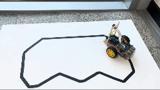
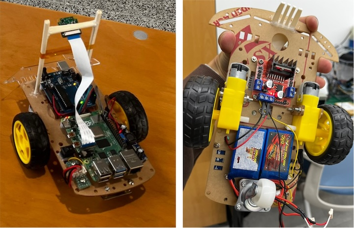

# 🚗 자율주행모형자동차



2023학년도 2학기 임베디드시스템설계 팀프로젝트

|이름|역할|
|-|-|
|이성호|영상 처리 담당, 차선 감지 및 조향 시스템 개발|
|정인우|하드웨어 제어 담당, DC 모터 PWM 제어 및 UART 통신 제어|

## 사용 부품



- [Raspberry Pi 4 Model B](https://www.raspberrypi.com/documentation/computers/raspberry-pi.html)
  - 영상 처리를 통해 라인을 인식하여 모터의 출력 정도를 결정하는 용도.
  - RPi Camera 2 모듈 사용.
- [Arduino Uno](https://docs.arduino.cc/hardware/uno-rev3)
  - PWM을 출력하여 모터 드라이버를 제어하는 용도.
- [L298N](https://www.st.com/en/motor-drivers/l298.html)
  - Arduino Uno의 작은 전류 신호로도 모터를 큰 전압으로 제어할 수 있도록 도와주는 부품, 일명 모터 드라이버.
  - H-Bridge 회로를 탑재하여 정방향, 역방향 모두 운용할 수 있음.
- [LM2596HV](https://www.ti.com/lit/ds/symlink/lm2596.pdf)
  - 입력 전압 4.5V to 60V를 3V to 35V로 변환해주는 스위칭 방식 DC 레귤레이터.
  - [디바이스마트](https://www.devicemart.co.kr/goods/view?no=1321158)에서 모듈로 판매.
  - 모듈에 달린 가변 저항으로 출력 전압을 조절할 수 있음.
  - 높은 입력 전압은 모터에 인가하고, 해당 모듈로 5V로 레귤레이팅한 전압은 라즈베리파이 보드에 인가하는 용도로 사용.
- 다이노지 리튬폴리머 배터리 2Cell
- 노란색 기어박스 DC 모터, 바퀴 및 프레임

## 통신 규약

- 총 6개의 문자를 정의한다.

  - 첫 번째 문자는 모터의 종류를 의미한다. `L`은 왼쪽 모터, `R`은 오른쪽 모터로 하자.
  - 두 번째 문자는 모터의 회전 방향을 나타낸다. `+`는 정방향, `-`는 역방향이라고 하자.
  - 다음 세 문자는 0에서 255 사이의 숫자를 문자열로 나타낸 것으로, 모터의 힘을 나타낸다.
  - 마지막 문자는 개행 문자 `\n`로 명령의 끝을 나타낸다.

- 다음은 예시이다.
  ```
  L+000\nR+000\nL+100\nR+100\nL-050\nR-050\nL+255\nR+255\nL+255\nR-255\n
  ```

## 차선 인식
1. 주어진 이미지를 특정 크기로 조정한다(40 x 30).
    - `img = cv2.resize(img, (WIDTH, HEIGHT))`
    - 영상의 크기를 줄임으로써 노이즈를 어느 정도 제거하고, 연산 속도를 빠르게 하는 효과가 있음.
2. 이미지를 흑백으로 변환한다.
    - `img = cv2.cvtColor(img, cv2.COLOR_BGR2GRAY)`
    - 배경은 흰색에 차선은 검은색으로 흑백 이미지로도 충분히 차선 검출이 가능하다.
3. 이진화를 수행하여 이미지를 흑백 이진 이미지로 변환한다.
    - `_, img = cv2.threshold(img, 128, 255, cv2.THRESH_BINARY)`
    - 128보다 큰 값은 255로, 작은 값은 0으로 변환한다.
4. 이진화된 이미지에 기준선을 지정한다.
    - `base_line = 0.5`
5. 기준선 위치에 해당하는 픽셀 값을 추출한다.
    - `arr = 255 - img[int(HEIGHT * base_line), :]`
6. 추출된 값 중 흰색 픽셀의 위치를 기준으로 수평 기준선의 위치를 계산한다.
    - `detected = np.where(arr > 0)`
    - 흰색 픽셀 위치의 평균을 계산하여 차선의 위치를 계산한다.

## 시행 착오

### USB 케이블 없이 UART 통신

- Raspberry Pi에서 나오는 TX는 Arduino Uno의 RX에 연결하여야 한다.
- Raspberry Pi는 3.3V 레벨로 동작하고, Arduino Uno는 5V 레벨로 동작한다. Raspberry Pi의 GPIO에 5V 신호를 인가해서는 **절대로** 안된다. 하지만 Arduino Uno에는 3.3V 신호를 주어도 정상적으로 동작하며, High 신호로 인식한다. 따라서, Raspberry Pi에서 Arduino Uno에 신호를 주는 것이 가능하다.
- 위의 내용으로 Raspberry Pi의 TX(8번 핀)을 Arduino Uno의 RX(0번 핀)에 연결하여 사용하려 했다.
- 하지만 Raspberry Pi 3버전 이후로는 UART0이 블루투스 기능으로 인해 사용할 수 없다고 하며, UART3을 사용하여야 한다는 것을 알게 됐다.
- `/boot/config.txt` 파일 끝에 `dtoverlay=uart3` 구문을 추가하고 재부팅하니 `/dev/ttyAMA1`이 생긴 것을 확인할 수 있었다 그리고 `dtoverlay -h uart3` 명령어를 통해 UART3이 사용하는 핀에 대한 정보를 알 수 있었고, `raspi-gpio get 4-5` 명령어를 통해 앞서 조회했던 uart3 핀이 잘 매핑돼 있는지 확인할 수 있었다.
- 위의 내용을 통해 Raspberry Pi와 Arduino Uno 간의 통신을 USB 케이블 없이 수행할 수 있게 됐다.
- [참고 자료](https://blog.naver.com/emperonics/222039301356)

### 저속에서 모터 구동하기

- 노란색 기어박스 DC 모터는 내부 기어의 마찰로 인해 저속에서는 구동이 되지 않는다.
- 따라서 PWM 신호를 통해 모터를 구동할 때, 최소한의 출력(duty_ratio)을 주어야 한다.
- DC 모터가 동작하는 최소한의 출력부터 최대 출력까지 매핑하는 함수를 작성하여 이를 적용한다.
